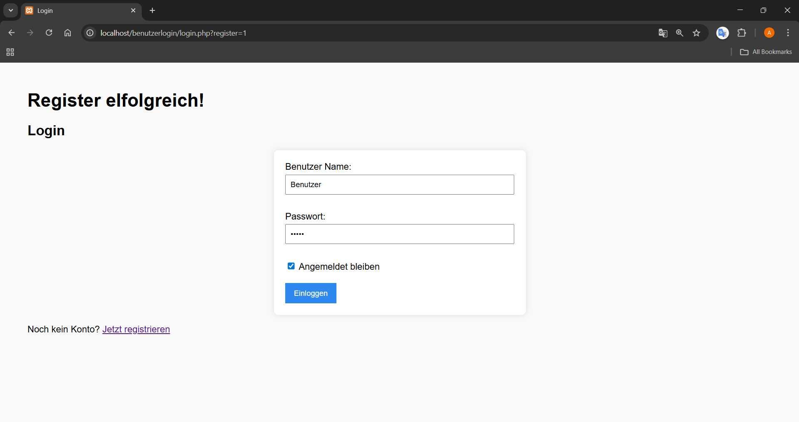
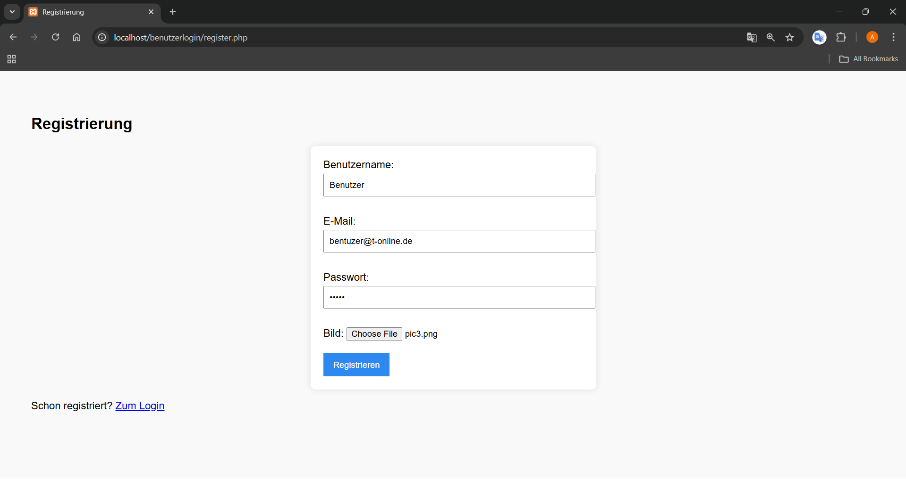
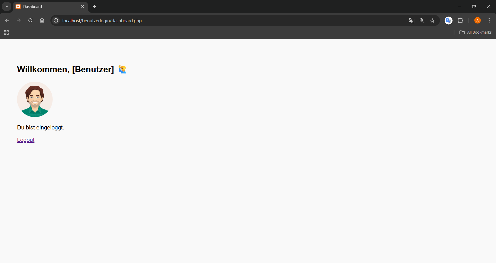
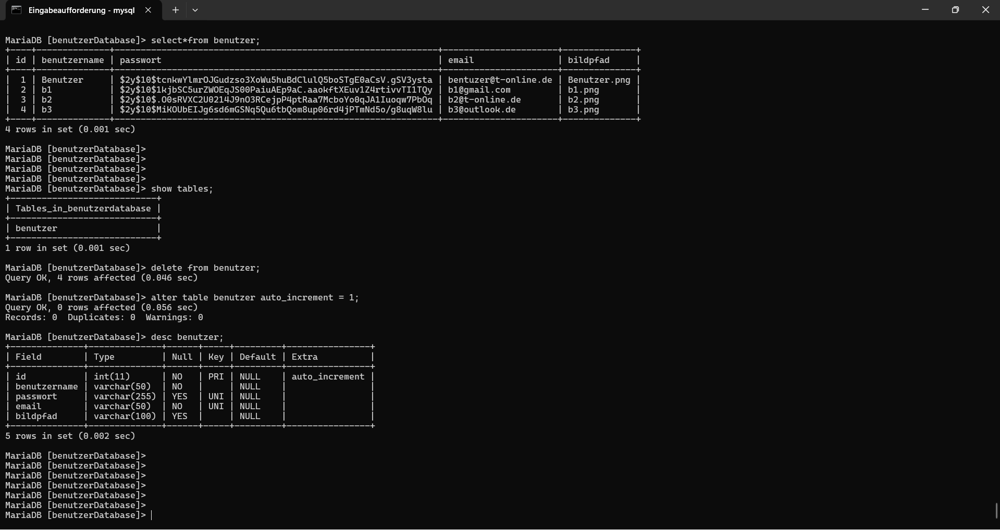

# Benutzer-Login-System

Dieses Projekt ist ein einfaches Benutzer-Login-System mit PHP und MySQL. Es ermöglicht Benutzern die Registrierung mit Profilbildern, sichere Anmeldung und Zugriff auf einen personalisierten Dashboard-Bereich.

## Features

- **Benutzerregistrierung:** Neue Benutzer können sich mit Benutzername, E-Mail, Passwort und Profilbild registrieren.
- **Sichere Anmeldung:** Passwort-Hashing und sichere Authentifizierung.
- **Profilbilder:** Upload und Anzeige von Benutzerprofilbildern.
- **Remember Me:** "Angemeldet bleiben" Funktion mit Cookies.
- **Dashboard:** Personalisierter Bereich für angemeldete Benutzer.
- **Sitzungsverwaltung:** Sichere Session-Verwaltung und Logout-Funktionalität.

## Voraussetzungen

- **Webserver:** z.B. XAMPP
- **PHP:** Version 7.x oder höher
- **MySQL/MariaDB**
- **Browser:** Chrome, Firefox, Edge, Safari

## Installation

1. **Repository kopieren**
   - Lade die Dateien in dein Webserver-Verzeichnis, z.B. `htdocs` bei XAMPP.

2. **Datenbank anlegen**
   - Erstelle eine neue Datenbank mit dem Namen `benutzerDatabase`.
   - Importiere anschließend die bereitgestellte Datei `benutzerDatabase.sql` (z.B. mit phpMyAdmin oder über die MySQL-Konsole), um die benötigten Tabellen und Strukturen automatisch anzulegen.

3. **Konfiguration prüfen**
   - Die Zugangsdaten zur Datenbank sind in `config/db.php` hinterlegt:
     ```php
     $server = "localhost";
     $benuzer = "root";
     $passwort = "";
     $dbname = "benutzerdb";
     ```
   - Passe sie ggf. an deine Umgebung an.

4. **Projekt starten**
   - Starte in XAMPP sowohl **Apache** als auch **MySQL**.
   - Öffne deinen Webbrowser und gib folgende Adresse in die URL-Leiste ein:  
     [http://localhost/benutzerlogin/login.php](http://localhost/benutzerlogin/login.php)

## Nutzung

### Registrierung (register.php)
- **Neue Benutzer:** Registrierung mit Benutzername, E-Mail und Passwort.
- **Profilbild:** Upload eines Profilbildes (JPEG, PNG unterstützt).
- **Validierung:** Automatische Überprüfung auf eindeutige Benutzernamen und E-Mail-Adressen.

### Anmeldung (login.php)
- **Login:** Anmeldung mit Benutzername und Passwort.
- **Remember Me:** Option "Angemeldet bleiben" für automatisches Login.
- **Sicherheit:** Sichere Passwort-Verifikation mit gehashten Passwörtern.

### Dashboard (dashboard.php)
- **Zugriffskontrolle:** Nur für angemeldete Benutzer zugänglich.
- **Logout:** Sichere Abmeldung mit Session-Bereinigung.

## Datenbank-Struktur

Das System verwendet folgende Haupttabelle:

- **benutzer:** 
  - `id` (INT, AUTO_INCREMENT, PRIMARY KEY)
  - `benutzername` (VARCHAR(50), NOT NULL)
  - `passwort` (VARCHAR(255), UNIQUE) - Gehashte Passwörter
  - `email` (VARCHAR(50), NOT NULL, UNIQUE)
  - `bildpfad` (VARCHAR(100)) - Pfad zum Profilbild

## Sicherheitsfeatures

- **Passwort-Hashing:** Verwendung von `password_hash()` und `password_verify()`
- **SQL-Injection-Schutz:** Prepared Statements für alle Datenbankabfragen
- **XSS-Schutz:** `htmlspecialchars()` für Benutzereingaben
- **Session-Sicherheit:** Sichere Session-Verwaltung
- **Zugriffskontrolle:** Automatische Weiterleitung für nicht authentifizierte Benutzer


## Vorschau

Login-Bereich (`login.php`):


Registrierung (`register.php`):


Dashboard (`dashboard.php`):


Datenbank (`benutzerDatabase.sql`):
